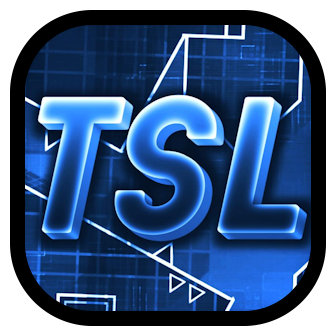

# TSL Integration
This is where she makes a mod.

# Installation
1) Download the latest version from [releases](https://github.com/Fryy55/tsl-integration/releases)
2) Install manually via Geode

# Feedback
You can leave your feedback in the Issues tab or by joining my [Discord server](https://discord.com/invite/4vqtjfdhTk)

# License
This project is distributed under the **Apache-2.0 License**.

See `LICENSE` for permissions, conditions and limitations.